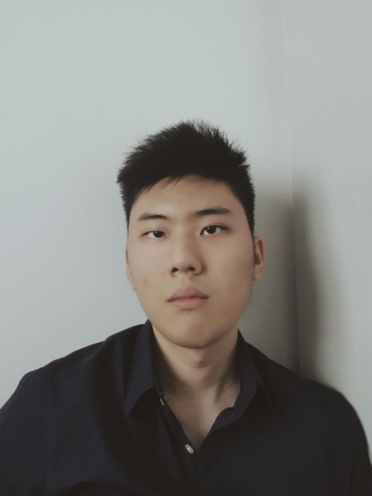

**[Home](./) \| [Publications](./publications.html) \| [Teaching](./teaching.html)**

---

## About Me:

I am currently an undergraduate student at the [National University of Singapore](http://www.nus.edu.sg/). I am interested in problems at the intersection of information theory and statistics. More specifically, my research investigates the fundamental limits and algorithmic performances of statistical algorithms. The main themes are:
- Information Theory
- Statistical Learning
- High-Dimensional Statistics

**Email:** "nelvintan" followed by "@u.nus.edu.sg"

**Links:** [CV](http://nelvintan.github.io/files/CV.pdf) \| [LinkedIn](https://www.linkedin.com/in/nelvin-tan-290377151/) \| [GitHub](https://github.com/nelvintan)
